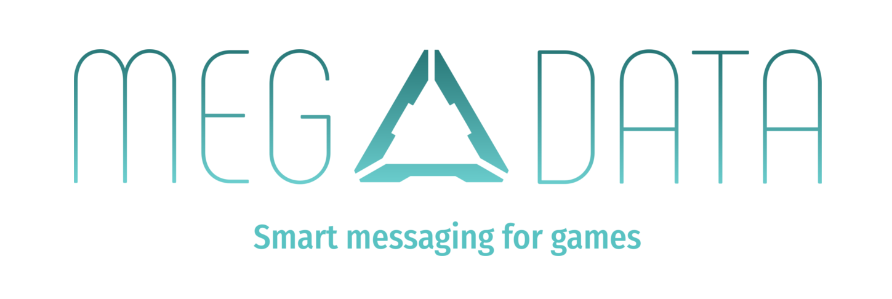

# 

[](https://github.com/Wizcorp/megadata/releases/latest)
[](https://www.npmjs.com/package/megadata)
[](https://www.npmjs.com/package/megadata)
[](https://gitter.im/megadata-typescript/Lobby?utm_source=share-link&utm_medium=link&utm_campaign=share-link)

[](https://greenkeeper.io/)
[](https://travis-ci.org/Wizcorp/megadata)
[](https://ci.appveyor.com/project/mage/megadata/branch/master)
[](https://coveralls.io/github/Wizcorp/megadata)

Megadata is a library you can use to serialize/deserialize network game
data.

This library will help you deal with:

  1. Defining type IDs and type classes
  2. Definining the serialization/deserialization format to use
  3. Re-using messages object, by creating and maintaining a message pool
  4. Sharing message libraries between client (JavaScript) and server (Node.js)
  5. TypeScript type checks

## Installation

```shell
npm install --save megadata
```

You will also need to make sure that the following configuration is set in your tsconfig.json:

```json
{
  "compilerOptions": {
    "experimentalDecorators": true
  }
}
```

## Usage

### Defining message types

> shared/messages/index.ts

```typescript
import megadata, { TypeDecorator } from 'megadata'

export const enum TypeIds {
  Join,
  Leave
}

export const Type: TypeDecorator<TypeIds> = megadata(module)
```

We first create a list of message types as a `const enum` and
list the messages we will send and receive in our game. We then
generate a `@Type` decorator

> shared/messages/types/Join.ts

```typescript
import { Type, TypeIds } from '../'
import MessageType from 'megadata/classes/MessageType'
import Binary, { Uint32 } from 'megadata/classes/BinarySerializationFormat'

@Type(TypeIds.Join, Binary)
export default class Join extends MessageType {
  @Uint32
  public time: number
}
```

> shared/messages/types/Leave.ts

```typescript
import { Type, TypeIds } from '../'
import MessageType from 'megadata/classes/MessageType'
import Json from 'megadata/classes/JsonSerializationFormat'

@Type(TypeIds.Leave, Json)
export default class Leave extends MessageType {
  public time: number
}
```


Next, we define what our `Join` and `Leave` messages type will look like, and
how we should serialize and deserialize it.

Megadata ships with two serialization formats:

  1. **binary**: deals only with messages containing numbers, but is blazing fast
  2. **json**: deals with any kind of data, but is slower

You may notice that the `Binary` serialization format requires additional annotations
this is required to define (and optimized) the size and speed of serialization and
deserialization.

### Sending and receiving messages

> server/classes/Player.ts

```typescript
import Connection from '...'
import MessageEmitter from 'megadata/classes/MessageType'
import MessageType, { IMessageType, MessageTypeData } from 'megadata/classes/MessageType'

export class Player extends MessageEmitter {
  constructor(private connection: Connection) {
    connection.on('message', async (buffer: ArrayBuffer) => {
      const message = MessageType.parse(buffer)
      await this.emitAsync(message)
      message.release()
    })
  }

  public async function send<T extends MessageType>(type: IMessageType<T>, data: MessageTypeData<T>) {
    const message = type.create<T>(data)
    const buffer = message.pack()
    await this.connection.write(buffer)
    message.release()
  }
}
```

Messages are recycled from an object pool to reduce the impact of garbage collection; therefore,
it is important to remember to release messages back into the object pool once you are done with them.

> server/classes/Game.ts

```typescript
import Player from './Player'

import Join from 'shared/messages/types/Join.ts'

export default class Game {
  // ...

  public addPlayer(player: Player) {
    player.on(Join, ({ time }) => console.log('Join time:', time))
    player.on(Leave, ({ time }) => console.log('Leave time:', time))
  }
}
```

### Messages and events auto-loading

#### Running a Node.js server with auto-loading

Auto-loading uses `require.context`, which is a webpack-specific
API. When using Megadata with auto-loading in Node.js, you will
therefore need to load the mock provided by the library.

```shell
ts-node -r megadata/register index.ts
```

#### Setting types auto-loading

> shared/messages/index.ts

```typescript
import megadata, { TypeDecorator } from 'megadata'

const types = require.context('./types/')

export enum TypeIds {
  Join,
  [...]
}

export const Type: TypeDecorator<TypeIds> = megadata(module, types)
```

The following code will dynamically load type classes on demand from
the `shared/messages/types` folder. If no listeners were ever set to
listen for messages of this type, an `Event.Unknown` event will be 
emitted (see below).

#### Setting event handlers auto-loading for a class inheriting MessageEmitter

> server/classes/Player.ts

```typescript
import MessageEmitter, { AutoloadEvents } from 'megadata/classes/MessageEmitter'

const events = require.context('../events/')

@AutoloadEvents(events)
export default class Player extends MessageEmitter {}
```

A given message emitter may end up handling a large number or events. Event
handlers auto-loading provides a mechanism for breaking event handling
down into event handler files that are auto-loaded on demand. In this
case, we will auto-load all events under `server/events`.


> server/events/Join.ts

```typescript
import Player from '../classes/Player'
import Join from 'shared/messages/types/Join'

export default function (player: Player) {
  player.on(Join, (message) => console.log('Received join event', message))
}
```

Event handler files export a single default function which will receive 
a message emitter instance; you may then set the even listeners according to
your needs.

### Custom serialization

> shared/messages/classes/CustomSerializationFormat.ts

```typescript
import MessageType from './MessageType'
import SerializationFormat, { ISerializerFunctions } from './SerializationFormat'

export default class CustomSerializationFormat extends SerializationFormat {
  public create<I, T extends MessageType>(id: I, size: number, attributes: any) {
    return {
      create: (...),
      pack: (...),
      unpack: (...),
    } as ISerializerFunctions<I, T>
  }
}
```

You can create your own custom serialization format. Above is a quick stub, but
you should have a look at the [default serialization formats](./classes) provided
by megadata.

## Acknowledgements

To @ronkorving for providing the initial implementation of this module.

Nintendo graphic by <a href="http://www.flaticon.com/authors/roundicons-freebies">roundicons_freebies</a> from <a href="http://www.flaticon.com/">Flaticon</a> is licensed under <a href="http://creativecommons.org/licenses/by/3.0/" title="Creative Commons BY 3.0">CC BY 3.0</a>. Check out the new logo that I created on <a href="http://logomakr.com" title="Logo Makr">LogoMakr.com</a> https://logomakr.com/9S4Qsk

## License

MIT License. Copyright (c) Wizcorp Inc.
